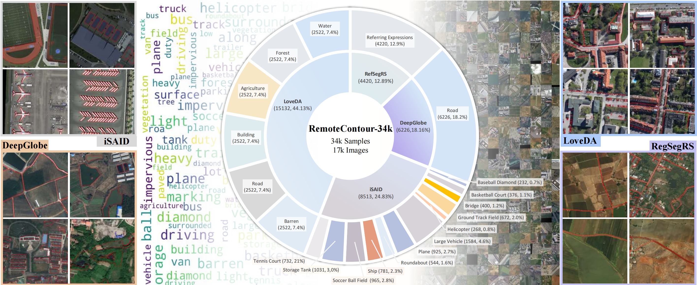
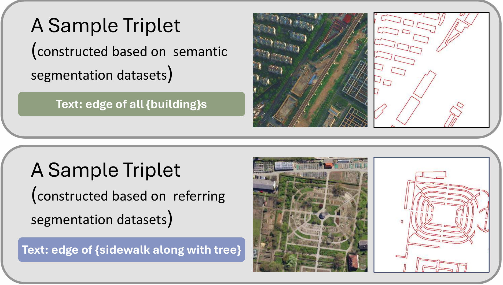
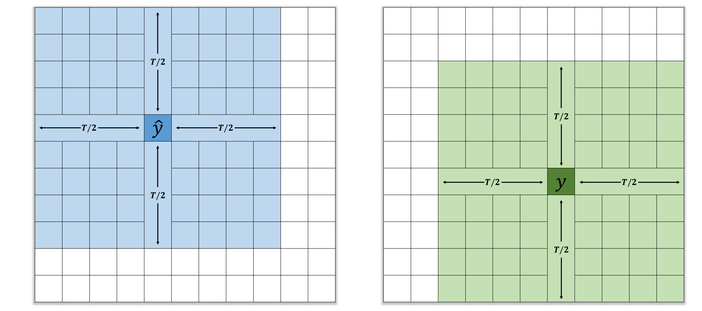
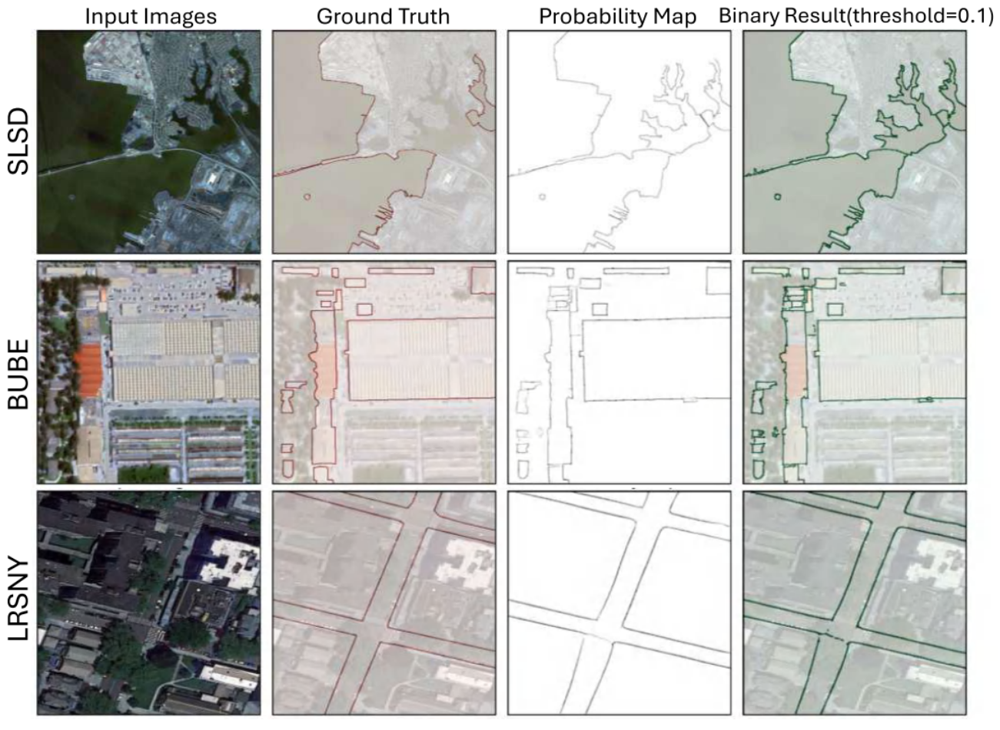
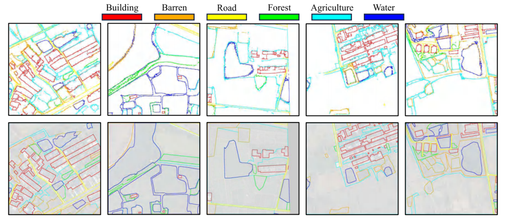

## Prompting DirectSAM for Semantic Contour Extraction   in Remote Sensing Images

[**Shiyu Miao (缪师宇)**](https://github.com/StevenMsy/)*
 &nbsp; &nbsp;
[**Delong Chen (陈德龙)**](https://chendelong.world/)*
 &nbsp; &nbsp;
[**Fan Liu (刘凡)**](https://multimodality.group/author/%E5%88%98%E5%87%A1/)✉
 &nbsp; &nbsp;

[**Chuanyi Zhang (张传一)**](https://ai.hhu.edu.cn/2023/0809/c17670a264073/page.htm)
 &nbsp; &nbsp;
[**Yanhui Gu (顾彦慧)**](https://komaba461.github.io/gu/)
 &nbsp; &nbsp;
[**Shengjie Guo (郭晟杰)**](https://github.com/Shengjie-Guo)
&nbsp; &nbsp;
[**Jun Zhou (周峻)**](https://experts.griffith.edu.au/7205-jun-zhou)

&nbsp; &nbsp; &nbsp; &nbsp; &nbsp; &nbsp;
 &nbsp; &nbsp; &nbsp; &nbsp; &nbsp; &nbsp;
&nbsp; &nbsp; &nbsp; &nbsp; &nbsp; &nbsp;
 

\* *Equal Contribution*

<!-- [ArXiv](https://arxiv.org/abs/2409.12435) |
Data (Coming Soon) -->

## Introduction

**DirectSAM-RS** is a vision-language foundation model designed for semantic contour extraction in optical remote sensing imagery. It builds on the **DirectSAM** model, which is pretrained on the SA-1B dataset and offers robust contour extraction. However, DirectSAM is **non-interactive** and **class-agnostic**, which limits its use in domain-specific applications like remote sensing.

To address these limitations, DirectSAM-RS introduces:

- **Text-guided contour extraction**: Unlike previous visual-only models, DirectSAM-RS accepts free-form textual prompts to specify semantic targets, enabling **zero-shot** contour extraction without requiring downstream training samples.
- **Cross-domain generalization**: DirectSAM-RS transfers contour extraction knowledge from natural images to remote sensing by leveraging a **large-scale dataset** curated from existing segmentation datasets (LoveDA, iSAID, DeepGlobe, RefSegRS), resulting in **34k image-text-contour triplets** (RemoteContour-34k).
- **Flexible prompting architecture**: A novel prompter design that fuses semantic information from textual prompts with image features via cross-attention, allowing the model to conditionally extract contours based on the input prompt.

DirectSAM-RS is implemented based on the Huggingface framework, with implementation details available in `model.py`.

## RemoteContour-34k

We constructed a semantic contour extraction dataset by repurposing existing semantic segmentation datasets with our proposed **Mask2Contour (M2C)** transformation. The **M2C** process produces a total of 34k image-text-contour triplets from LoveDA, iSAID, DeepGlobe, and RefSegRS datasets. We name this resulting dataset **RemoteContour-34k**.

The RemoteContour-34k dataset are available for download via BaiduNetdisk or Google Drive.

- **BaiduNetdisk Link**: [Click here to download](https://pan.baidu.com/s/1DFFEZzP8_YZybauQLkenzw?pwd=mmsy)&nbsp;&nbsp;**Extraction Code**: `mmsy`

- **Google Drive Link**: [Click here to download](https://drive.google.com/file/d/1BmSLAASVie93_seg7QdC3Wx2G7NXc_tO/view?usp=sharing)

## Downstream task datasets

We validate DirectSAM-RS on three downstream contour extraction datasets: SLSD for coastline extraction, Beijing Urban Building Extraction (BUBE), and LRSNY for road extraction. These three downstream task datasets can also be downloaded via BaiduNetdisk.

- **BaiduNetdisk Link**: [Click here to download](https://pan.baidu.com/s/1Orb_WTXWr8p9kiqj06U7QA?pwd=mmsy)&nbsp;&nbsp;**Extraction Code**: `mmsy`

- **Google Drive Link**: [Click here to download](https://drive.google.com/file/d/1BmSLAASVie93_seg7QdC3Wx2G7NXc_tO/view?usp=sharing)

## Mask2Contour (M2C) transformation

The **Mask2Contour (M2C)** transformation is a simple and effective method for extracting semantic contours from segmentation masks. This approach leverages the `cv2.findContours` function from OpenCV to efficiently convert segmented regions into their corresponding contours.

If you want to convert other semantic segmentation labels into contours, you can refer to the code in the `utils` folder. If your semantic segmentation labels are single-channel like LoveDA, use `utils/M2C_1channel.py`. If your labels are three-channel like iSAID, use `utils/M2C_3channel.py`. You will need to modify the file paths and `category_dict` accordingly when using the scripts.

### Triplets Sample

The figure illustrates two examples: one constructed from semantic segmentation datasets and the other from referring image segmentation datasets.

## Evaluation Metrics

Following **HED**, we used the following evaluation metrics in the experiment: Optimal Dataset Scale (ODS) and Optimal Image Scale (OIS). Based on the $d_{max}$ index and image size $S$, the pixel tolerance $T$ is calculated by $T=EvenCeil(S\times d_{max})$. EvenCeil rounds the input $S \times d_{max}$ up to the nearest even integer. The ODS and OIS were calculated under the tolerance $T$ setting. Additionally, we employed Line Intersection over Union with a 3-pixel dilated kernel (LineIoU@3), following the evaluation metrics of BUBE. 

For instance, given an image of 1024×1024 pixels, the pixel tolerance in both horizontal and vertical directions is 8 pixels. As illustrated in the figure, when calculating Precision (left), let $\hat{y}$ represent the model-predicted edge pixel, depicted in dark blue. A prediction is considered correct if any ground truth pixel falls within the light blue region (representing the tolerance area) or the dark blue region. More formally, if $\exists y \in \mathcal{Y}$ such that $d(y, \hat{y}) \leq \frac{T}{2}$, where $\mathcal{Y}$ is the set of ground truth pixels and $d(\cdot,\cdot)$ is the Euclidean distance, then $\hat{y}$ is counted as a true positive. Conversely, when calculating Recall (right), let $y$ denote the ground truth pixel, depicted in dark green. A ground truth pixel is considered recalled if any predicted pixel lies within the light green region or the dark green region. Formally, if $\exists \hat{y} \in \hat{\mathcal{Y}}$ such that $d(y, \hat{y}) \leq \frac{T}{2}$, where $\hat{\mathcal{Y}}$ is the set of predicted pixels, then $y$ is counted as correctly recalled.

## Benchmarking

We evaluated the capabilities of DirectSAM-RS under both ZS and FT scenarios. DirectSAMRS consistently delivered superior results, achieving state-of-the-art performance on multiple downstream benchmarks for edge detection. This highlights its robustness and adaptability across diverse tasks, showcasing its potential as a versatile tool for real-world applications.

### Fine-tuning Scenario

We fine-tuned DirectSAM-RS on the training splits of each benchmark dataset and evaluated its performance on the corresponding validation splits. DirectSAM-RS outperformed previous state-of-the-art methods for road, coastline, and building extraction, achieving impressive ODS metric improvements of 21%, 5%, and 7%, respectively. Visualization of the inference results is provided in the figure above. The model’s exceptional performance across various edge detection tasks highlights its strong practical value and potential for real-world applications.

### Zero-shot Scenario

We assessed the performance of our DirectSAM-RS model in a ZS scenario across three downstream edge detection tasks, achieving competitive results without the need for task-specific FT. The comparison between DirectSAM-RS ZS and DirectSAM ZS underscored the substantial benefits of incorporating textual semantics. This demonstrates that leveraging language information enhances the generalization capabilities of DirectSAMRS, making it more effective across diverse tasks. Figure 9 illustrates the ZS performance of DirectSAM-RS, where edges of different colors represent the edges of different categories, corresponding to prompts of different categories given to DirectSAM-RS.

