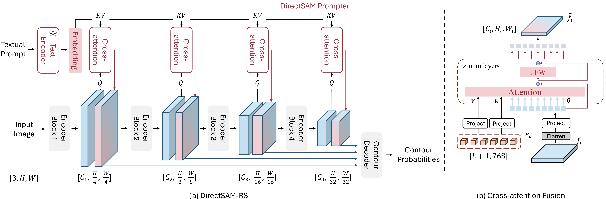
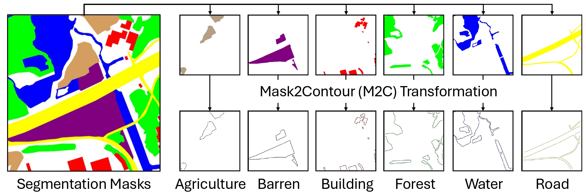

## Prompting DirectSAM for Semantic Contour Extraction   in Remote Sensing Images

[**Shiyu Miao (缪师宇)**](https://github.com/StevenMsy/)*
 &nbsp; &nbsp;
[**Delong Chen (陈德龙)**](https://chendelong.world/)*
 &nbsp; &nbsp;
[**Fan Liu (刘凡)**](https://multimodality.group/author/%E5%88%98%E5%87%A1/)✉
 &nbsp; &nbsp;

[**Chuanyi Zhang (张传一)**](https://ai.hhu.edu.cn/2023/0809/c17670a264073/page.htm)
 &nbsp; &nbsp;
[**Yanhui Gu (顾彦慧)**](https://komaba461.github.io/gu/)
 &nbsp; &nbsp;
[**Shengjie Guo (郭晟杰)**](https://github.com/Shengjie-Guo)
&nbsp; &nbsp;
[**Jun Zhou (周峻)**](https://experts.griffith.edu.au/7205-jun-zhou)

&nbsp; &nbsp; &nbsp; &nbsp; &nbsp; &nbsp;
 &nbsp; &nbsp; &nbsp; &nbsp; &nbsp; &nbsp;
&nbsp; &nbsp; &nbsp; &nbsp; &nbsp; &nbsp;
 

\* *Equal Contribution*

<!-- [ArXiv](https://arxiv.org/abs/2409.12435) |
Data (Coming Soon) -->

## Introduction

**DirectSAM-RS** is a vision-language foundation model designed for semantic contour extraction in optical remote sensing imagery. It builds on the **DirectSAM** model, which is pretrained on the SA-1B dataset and offers robust contour extraction. However, DirectSAM is **non-interactive** and **class-agnostic**, which limits its use in domain-specific applications like remote sensing.

To address these limitations, DirectSAM-RS introduces:

- **Text-guided contour extraction**: Unlike previous visual-only models, DirectSAM-RS accepts free-form textual prompts to specify semantic targets, enabling **zero-shot** contour extraction without requiring downstream training samples.
- **Cross-domain generalization**: DirectSAM-RS transfers contour extraction knowledge from natural images to remote sensing by leveraging a **large-scale dataset** curated from existing segmentation datasets (LoveDA, iSAID, DeepGlobe, RefSegRS), resulting in **34k image-text-contour triplets** (RemoteContour-34k).
- **Flexible prompting architecture**: A novel prompter design that fuses semantic information from textual prompts with image features via cross-attention, allowing the model to conditionally extract contours based on the input prompt.

DirectSAM-RS is implemented based on the Huggingface framework, with implementation details available in `model.py`.

## RemoteContour-34k

We constructed a semantic contour extraction dataset by repurposing existing semantic segmentation datasets with our proposed **Mask2Contour (M2C)** transformation. The **M2C** process produces a total of 34k image-text-contour triplets from LoveDA, iSAID, DeepGlobe, and RefSegRS datasets. We name this resulting dataset **RemoteContour-34k**.

The RemoteContour-34k dataset are available for download via BaiduNetdisk or Google Drive.

- **BaiduNetdisk Link**: [Click here to download](https://pan.baidu.com/s/1DFFEZzP8_YZybauQLkenzw?pwd=mmsy)&nbsp;&nbsp;**Extraction Code**: `mmsy`

- **Google Drive Link**: [Click here to download](https://drive.google.com/file/d/1BmSLAASVie93_seg7QdC3Wx2G7NXc_tO/view?usp=sharing)

## Downstream task datasets

We validate DirectSAM-RS on three downstream contour extraction datasets: SLSD for coastline extraction, Beijing Urban Building Extraction (BUBE), and LRSNY for road extraction. These three downstream task datasets can also be downloaded via BaiduNetdisk.

- **BaiduNetdisk Link**: [Click here to download](https://pan.baidu.com/s/1Orb_WTXWr8p9kiqj06U7QA?pwd=mmsy)&nbsp;&nbsp;**Extraction Code**: `mmsy`

- **Google Drive Link**: [Click here to download](https://drive.google.com/file/d/1BmSLAASVie93_seg7QdC3Wx2G7NXc_tO/view?usp=sharing)

## Mask2Contour (M2C) transformation

The **Mask2Contour (M2C)** transformation is a simple and effective method for extracting semantic contours from segmentation masks. This approach leverages the `cv2.findContours` function from OpenCV to efficiently convert segmented regions into their corresponding contours.

If you want to convert other semantic segmentation labels into contours, you can refer to the code in the `utils` folder. If your semantic segmentation labels are single-channel like LoveDA, use `utils/M2C_1channel.py`. If your labels are three-channel like iSAID, use `utils/M2C_3channel.py`. You will need to modify the file paths and `category_dict` accordingly when using the scripts.

